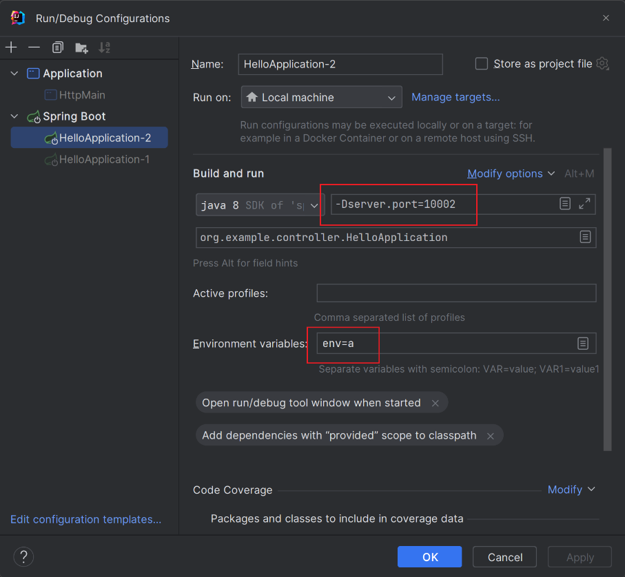

```agsl
CREATE TABLE `table_a` (
  `id` bigint(20) NOT NULL AUTO_INCREMENT COMMENT '编号',
  `req_id` bigint(20) NOT NULL COMMENT '请求参数',
  PRIMARY KEY (`id`)
) ENGINE=InnoDB AUTO_INCREMENT=34 DEFAULT CHARSET=utf8 COMMENT='服务a表';

CREATE TABLE `table_b` (
  `id` bigint(20) NOT NULL AUTO_INCREMENT COMMENT '编号',
  `req_id` bigint(20) NOT NULL COMMENT '请求参数',
  PRIMARY KEY (`id`)
) ENGINE=InnoDB AUTO_INCREMENT=34 DEFAULT CHARSET=utf8 COMMENT='服务b表';

truncate table_a;
truncate table_b;

select count(*) from table_b;
select count(*) from table_a;

select req_id from table_a where req_id in (select req_id from table_b) order by req_id;
select req_id from table_b where req_id in (select req_id from table_a) order by req_id;

select * from table_a where req_id = 17370;
select * from table_b where req_id = 17370;
```

